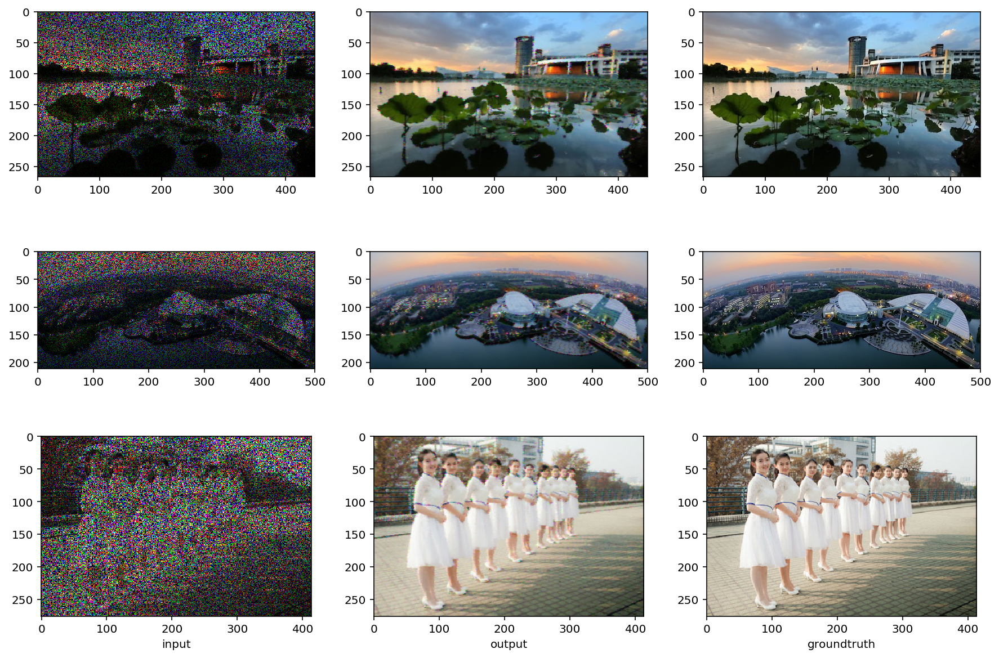
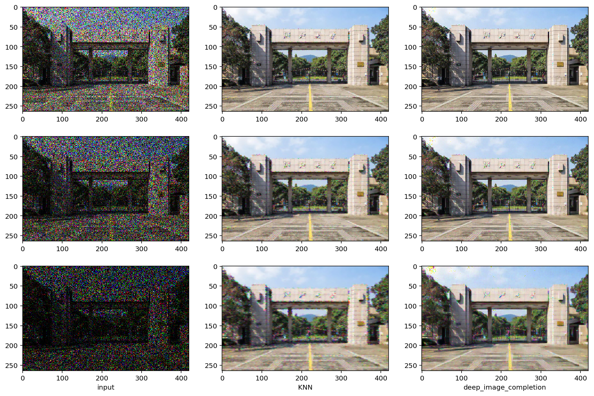
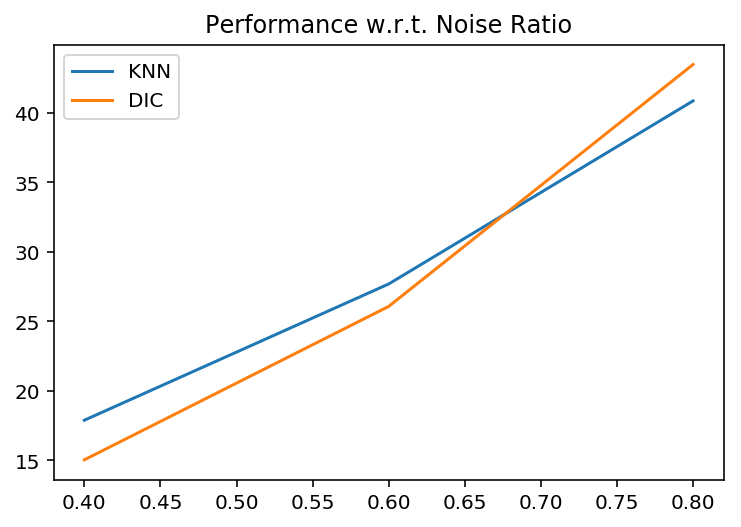

# Image Inpainting

A school assignment on image inpainting.

Implemented KNN and General Deep Image Completion

#### KNN results

#### Deep Image Completion Results

#### Comparison

#### Squared Pixel-wise Error

